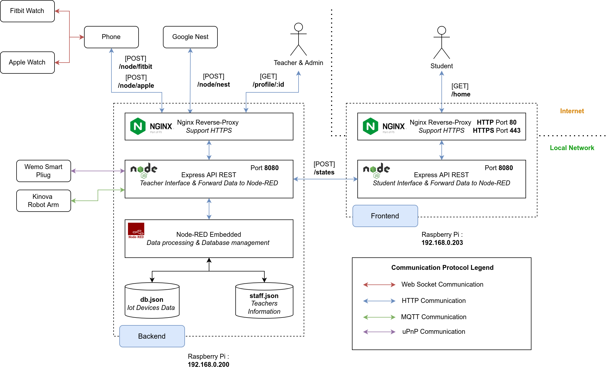

# Architecture

The project is divided into 2 main parts at the architectural level. One is the Student part and the other one is the Teacher/Admin part. 
- The Student part consists in a web server accessible by the students in order to have access to a graphic interface summarizing the state of availability of their teachers. In this Wiki, we will call this part the **Frontend** of the WIMP System. You can learn more about this part [here](./frontend/frontend.md).

- The Teacher/Admin part, is the heart of the WIMP project. In this Wiki, we will call this part the **Backend** of the WIMP System. You can learn more about this part [here](./backend/intro.md).

## Architecture of the POC

Here is a diagram of the Architecture that we have setup for the POC of the WIMP system at the Concordia Computer Science Research Lab:

## Scenario Student 
- The frontend server will retrieve the teacher availability information by sending a GET request to the backend.
- The Express.js server of the backend will check the security of the request.
- The Express.js server of the backend will get the information from its API (which is actually the Node-RED server)
- The Node-RED server will request the devices to collect their state/data, process the information and send a JSON back to the Express.js server of the backend.
- The Express.js server of the backend will send the information back to the frontend server so that the student can see the availability of his teachers.

## Scenario Professor
- The professor need to be connected to the local Concordia network to have access to the backend server.
- This server will act as a classic web server for him. The server will send him a his personal page where his information are stored so that he can, for example, modify his availability messages.
- All saved changes will modify the database that stores his information.
- The professor will also be able to access his Node-RED flow to modify the treatment that will be done on the information of his IoT devices.
