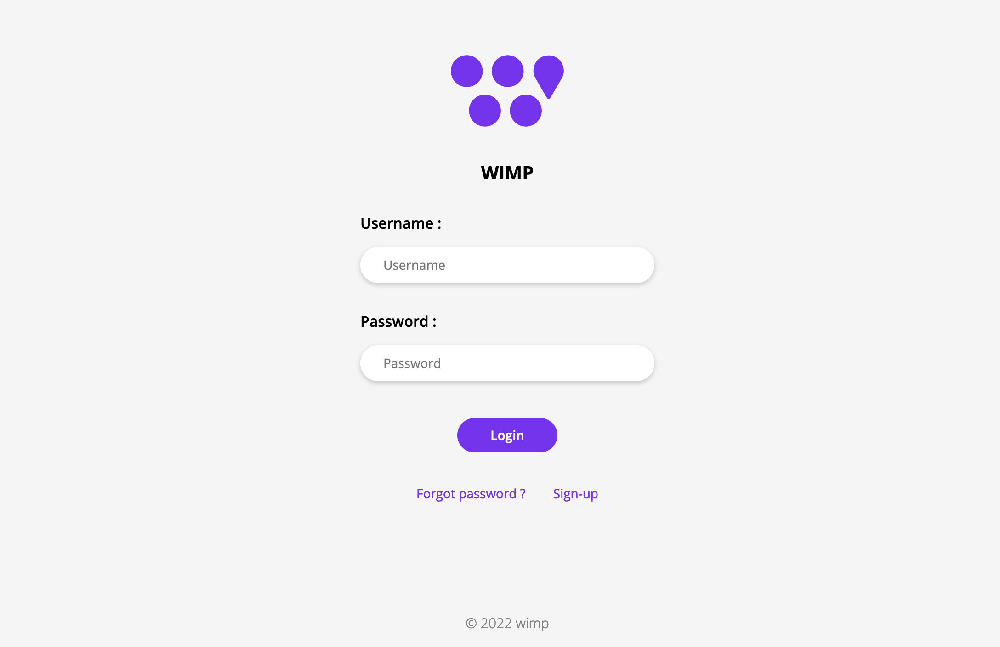

# Frontend

## Routes
The express server delivers a very classical REST api whose routes are :
* /home &rarr; Dashboard with information on teachers availability
* /login &rarr; Login page & Login form
* /error &rarr; Display http errors

## Data
This server uses the REST API provided by the backend server to retrieve information as .json. With a `[POST]/states` the web server receives all the status of the teachers. 

:::note
The request on `/states` is a POST method because the frontend needs to provide a password in the body of the reques to access the backend data.
:::

The web server processes the information according to the level of education of the connected person and returns the corresponding page. 
See ```app.get('/home'...``` in /server.js.


## Login 
A connection system has been set up to allow data security and to authenticate the students (especially to know the level of study called *role*). 
there are 3 different roles :
- Student
- Researcher
- Colleague of Teacher


Students who go to the site without a logged session are redirected to the login page. They fill their username and password.



This page is under the /login route.
With [GET]/login that sends the page back and [POST]/login that receives the information to establish the connection or not.
The `static/login/login.js` which is link to the `pages/login.html` do the [POST] request to submit the form.
```js
$(function(){
    $(function(){
        $('#login-form').on('submit', function(e){
            alertify.set('notifier','position', 'top-right');
            e.preventDefault();
            $.ajax({
                url: protocol + '://' + frontendUrl + '/login',
                type: 'POST',
                data: $('#login-form').serialize(),
                success: function(data){
                    location.href = "/home";
                },
                error: function(data){
                    console.log("failed");
                    if (data.status === 401) { alertify.error(data.statusText + ": Invalid credentials", 'error', 5 )};
                }            
            });
        });
    });
});
```


## Security
The connection is made with Passport.js.
When the connection form is submitted ([POST]/login) Passport is called and checks if the couple `{"idStudent" : "password" }` in the database `database/db_acc.json`.
Passport store the conections data in a http session to maintain the connection without having to reconnect each time. See more about [passport](https://www.passportjs.org/packages/passport-local/).

```js
// /server.js
passport.use(new LocalStrategy(
    (username, password, done) => {
        const db_acc = new dbjson( __dirname + '/database/db_acc.json');
        let acc = db_acc.get(username);
        if (acc === undefined || acc.pwd != password){
            console.log('Failed to authorize : ' + username);
            return done(null, false);
        } 
        else{
            console.log('Authorized : ' + username);
            let authenticated_user = {
                id: username,
                role: acc.role,
            };
            return done(null, authenticated_user);
        }  
    }
));

app.post('/login',
  passport.authenticate('local', { failureMessage: "true" }),
  async (req, res) => {
      res.redirect('/home');
});
```

The checkAuthenticated function is used as a middelware to check if the session contains a login. If not, the requested page is inaccessible and the user is redirected to /login

```js
// /server.js
checkAuthenticated = (req, res, next) => {
    console.log("Authenticating for access to " + req.originalUrl + "...")
    if (req.isAuthenticated()) { 
        console.log("Authentication done for access to " + req.originalUrl);
        return next();
    }
    res.redirect("/login")
}
```

## ?
** Why no registration pages? **
because the students are theorically already in the concordia database.
